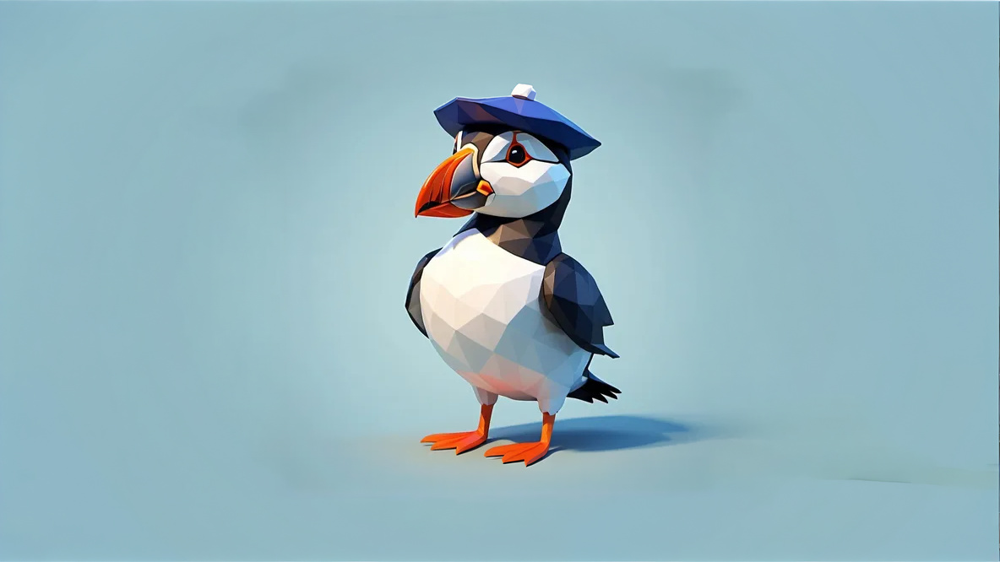

# RNLI open source data chatbot
This is a chatbot that is linked to RNLI open data return of service database.
The database is accessed through the connectors classes.  It is currently set to use the open data database, however there is a Databricks config to connect to incident data. To run using the databricks option you need to change the connector class import in `ai_chatgtp.py`.  At the moment it is set up with minimal manual SQL cleaning, however if you find it is needed, you can add clensing commands in the `clean_sql` method of the `AIBotDialog` class.

# This example is hosted on my-july-bot on azureStep by step how to do it
1. Create azure resource group
2. Within the resource group create an azure bot - create a new ASP (Azure service provision) as part of the set up within the resource group
3. In the bot configuration AppID Manage password - delete the password and generate a new one
4. Put the password and AppId into the config.py
5. Create an azure webapp within the resource group
6. put the webapp url with /api/messages into the bot url
7. deploy the code to the web service in vs code
8. add `gunicorn --bind 0.0.0.0 --worker-class aiohttp.worker.GunicornWebWorker  app:APP` to the web app start up command in the configuration and then restart the web app.  You should now be able to use the test in web chat functionality in the bot resource# To set up deployment from GitHub repo and specific branch
https://www.youtube.com/watch?v=1w7UT_wx-tk&t=953s
As seen in this vid
1. Go to deployment centre in the web app and select github
2. log in and select the repo and branch.
3. when you save this it will commit a ci/cd workflow file to the repo and generate a new identity key to talk to github
4. Now when you push to main the changes will trigger the build and changes will be carried through#NOTE# makek sure you put branch protection on main to stop people messing it up!!
echo bot testingThis bot has been created using [Bot Framework](https://dev.botframework.com), it shows how to create a simple bot that accepts input from the user and echoes it back.## PrerequisitesThis sample **requires** prerequisites in order to run.### Install Python 3.6## Running the sample
- Run `pip install -r requirements.txt` to install all dependencies
- Run `python app.py`
## Testing the bot using Bot Framework Emulator[Bot Framework Emulator](https://github.com/microsoft/botframework-emulator) is a desktop application that allows bot developers to test and debug their bots on localhost or running remotely through a tunnel.- Install the Bot Framework Emulator version 4.3.0 or greater from [here](https://github.com/Microsoft/BotFramework-Emulator/releases)### Connect to the bot using Bot Framework Emulator- Launch Bot Framework Emulator
- Enter a Bot URL of `http://localhost:3978/api/messages`
## Further reading- [Bot Framework Documentation](https://docs.botframework.com)
- [Bot Basics](https://docs.microsoft.com/azure/bot-service/bot-builder-basics?view=azure-bot-service-4.0)
- [Dialogs](https://docs.microsoft.com/azure/bot-service/bot-builder-concept-dialog?view=azure-bot-service-4.0)
- [Gathering Input Using Prompts](https://docs.microsoft.com/azure/bot-service/bot-builder-prompts?view=azure-bot-service-4.0&tabs=csharp)
- [Activity processing](https://docs.microsoft.com/en-us/azure/bot-service/bot-builder-concept-activity-processing?view=azure-bot-service-4.0)
- [Azure Bot Service Introduction](https://docs.microsoft.com/azure/bot-service/bot-service-overview-introduction?view=azure-bot-service-4.0)
- [Azure Bot Service Documentation](https://docs.microsoft.com/azure/bot-service/?view=azure-bot-service-4.0)
- [Azure CLI](https://docs.microsoft.com/cli/azure/?view=azure-cli-latest)
- [Azure Portal](https://portal.azure.com)
- [Language Understanding using LUIS](https://docs.microsoft.com/azure/cognitive-services/luis/)
- [Channels and Bot Connector Service](https://docs.microsoft.com/azure/bot-service/bot-concepts?view=azure-bot-service-4.0)